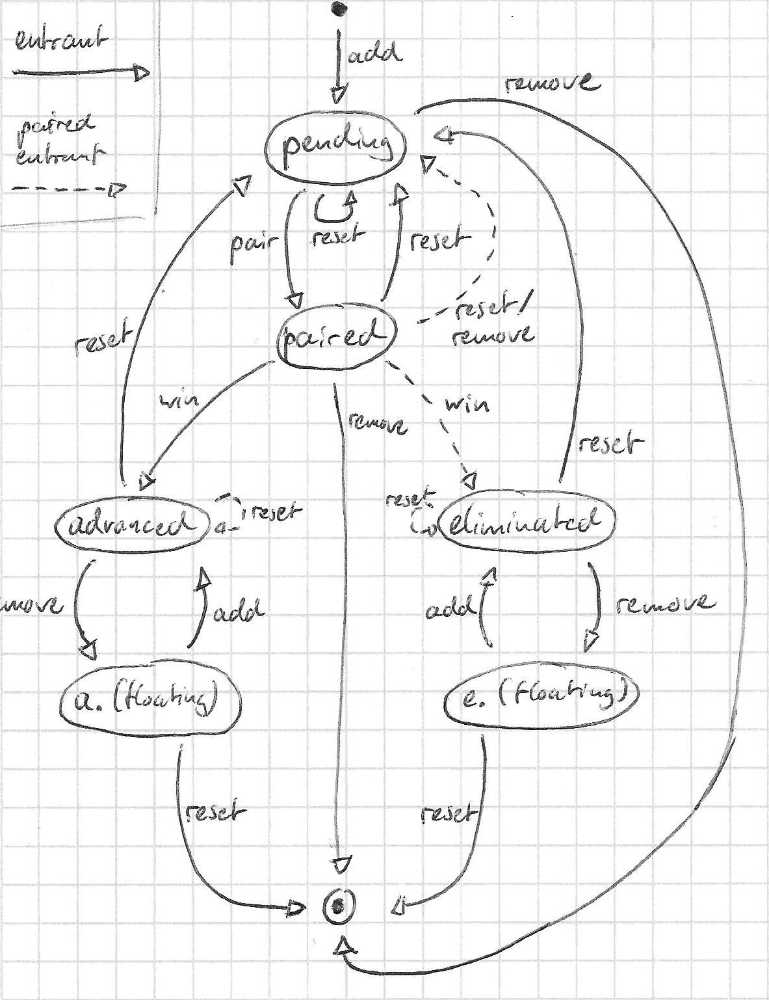

# Manko - Manual Knockout

Diese Modifikation unterstützt den Nutzer dabei
einfache und dynamische K.O.-Turniere
innerhalb des Spiels mit Befehlen zu verwalten.

> **Manko** (lat. *mancus*), &bdquo;unvollständig&ldquo; &ndash;
Turniere im Sinne dieser Modifikation sind dynamisch.
Teilnehmer werden während des Ablaufs hinzugefügt
und sind nicht zwingend zu Beginn des Turniers bekannt.
Das Turnier ist anfangs unvollständig.

## Vorteile

Das Anwendungsfenster muss nicht gewechselt werden
und man kann bei Eingabe des Namens eines Spielers
auf die Auto-Vervollständigung des Spiels zurückgreifen.
Ankündigungen darüber, wer als Nächstes dran ist,
werden automatisch im Chat an alle Spieler gesendet,
sodass diese nicht manuell eingegeben werden müssen.
Außerdem können Paarungen automatisch generiert werden,
was den Verwaltungsaufwand auf Seiten des Turnierleiters
immens senkt.

## Definitionen

Ein Turnier wird im K.O.-Format gespielt
und besteht aus mehreren Runden.
Jede Runde besteht aus mehreren Paarungen.
Eine Paarung ist ein Zusammentreffen zweier Spieler,
die gegeneinander in einem Spiel oder Kampf antreten.
Der Gewinner einer Paarung kommt in die nächste Runde.
Verlierer fliegen raus und kommen nicht weiter.

Spieler können zu Beginn oder während einer Runde
zum Spiel hinzugefügt werden.
Spieler können ebenfalls zu jedem Zeitpunkt entfernt werden.
Paarungen zwischen Spielern werden zufällig bestimmt.

Der Ablauf des Finales eines Turniers
wird durch die Anzahl der übrigen Spieler bestimmt.
Bei vier Spielern wird im K.O.-Verfahren fortgesetzt.
Bei drei Spielern geht es im Round Robin weiter.

Platzierungen gehen immer an die ersten 3 Gewinner.
Basierend darauf wird auch das Finale ausgetragen.

## Limitierungen

Um den Programmieraufwand in Grenzen zu halten
und möglichst zeitig ein brauchbares Programm zu erhalten,
werden bestimmte Limitierungen eingeführt.
Damit wird verhindert das System unnötig allgemein zu formulieren,
wenn es doch ursprünglich
für einen sehr speziellen Zweck entwickelt werden sollte.

### Anzahl der Gewinner

Es werden exakt 3 Gewinner bestimmt.
Dies kann nicht konfiguriert werden.
Nach Bedarf können Platzierungen weggelassen
oder der vierte Platz hinzugedacht werden.
Eine entsprechende Programmierung ist nicht vorgesehen.

### Notwendige Spieleranzahl für das Finale

Das Finale kann nicht in der ersten Runde ausgetragen werden.
Um in die nächste Runde überzugehen werden mindestens 3 Spieler benötigt.
Dies ist mit der vorherigen Limitierung gekoppelt (3 Gewinner).
Das heißt, dass das Turnier mindestens 6 Spieler in der ersten Runde benötigt.
Man könnte aus der ersten Runde ableiten,
welcher der Verlierer noch im Finale spielen soll,
um die oben genannten drei Platzierungen zu belegen.
Der Entwicklungsaufwand steht jedoch nicht in Relation zum tatsächlichen Nutzen,
da sich ein Turnier mit fünf oder weniger Teilnehmern kaum lohnen würde.

### Art des Turniers

Die Art des Turniers ist folgendermaßen festgelegt.
Die ersten Runden werden im K.O.-System (single-elimination) durchgeführt.
Basierend auf der Anzahl an Spielern im Finale (3 oder 4)
wird entweder im Round Robin oder weiterhin im K.O.-System fortgesetzt.
Andere Arten der Ausführung sind nicht konfigurierbar.

### Keine parallel laufenden Turniere

Diese Modifikation ist an die gerichtet,
die vollkommen manuell Turniere im Spiel durchführen möchten.
Dabei ergibt es keinen Sinn mehrere gleichzeitig durchzuführen,
weshalb es auch nicht möglich ist mehr als eines
zu einem gegebenen Zeitpunkt zu halten.

## Konzepte

### Dynamisches Turnier

Ein Turnier im Sinne dieser Modifikation
ist ein dynamisches Turnier.
Das bedeutet, dass Spieler auch
während der Durchführung des Turniers
hinzugefügt werden können.
Paarungen werden nicht im Vorhinein generiert.

### Finale niemals in der ersten Runde

Aufgrund der Dynamik eines Turniers
kann es vorkommen, dass in der ersten Runde
nicht genügend Teilnehmer vorhanden sind.
Bei drei Teilnehmern wäre zum Beispiel zu entscheiden,
ob diese bereits im Round Robin um die Trophäe spielen sollen,
oder im Nachhinein noch Spieler hinzugefügt werden können.
Diese Modifikation nimmt an,
dass die erste Runde niemals das Finale ist.

### Parallel aktive Paarungen

Paarungen können parallel durchgeführt werden.
Wenn ein Sieger festgelegt wird,
kann damit auf die zugehörige Paarung geschlossen werden.

> **TODO**  
> Die aktuelle Implementierung kann nur eine Paarung handhaben.

### Speicherung von Zustandsdaten

Daten werden in einer SQLite-Datenbank gespeichert.
Neben des strukturierten Formats profitiert man
von einer persistenten Speicherung der Daten
und von Ausfallsicherheit, falls das Spiel abstürzen sollte.

Damit ein Turnier nach einem Neustart des Spiels
fortgesetzt werden kann, speichert das Programm
keine Zustandsdaten im Hauptspeicher.
Jeder Befehl nimmt sich die Daten aus der Datenbank,
welcher er benötigt, macht seine Arbeit
und speichert den neuen Zustand direkt im Anschluss ab.

## Diagramme

### Sequenzdiagramm eines Teilnehmers



## Befehle

Solche Befehle, welche kritische Aktionen durchführen,
müssen bestätigt werden, indem der Befehl erneut gesendet wird.
Konkret bedeutet dies im Spiel: Die obere Pfeiltaste und Enter drücken.
Alternativ kann mit `/t:cancel` oder der Eingabe eines anderen Befehls abgebrochen werden.
Befehle, die dieser Regel unterliegen,
erhalten ein `(y/n)` Suffix.

Befehle mit einem Alias, d.h. mit einer kürzeren Version,
die schneller eingetippt ist, werden folgendermaßen angegeben:
> `/t:a /t:alias <Argument>`

### Verwaltung

#### Ein Turnier starten

```
/t:new
```
Startet ein neues Turnier.
Dies ist nur möglich,
sofern nicht bereits ein Turnier vorhanden ist.

#### Ein Turnier beenden

```
/t:end  (y/n)
```
Beendet das aktuelle Turnier
und löscht alle vorhandenen Daten.

#### Daten exportieren

```
/t:export
```
Exportiert Turnierdaten im leserlichen Textformat,
als auch die Datenbank im Rohformat,
um diese später oder mit einem anderen Client laden zu können.
Die Text-Datei ist so aufgebaut,
dass mit den dort verfügbaren Daten
das Turnier manuell fortgesetzt werden könnte.

#### Teilnehmer auflisten 

```
/t:list
```
Listet alle Spieler der aktuellen Runde auf.
Informiert ebenfalls darüber wer bereits gespielt,
wer gewonnen und wer verloren hat.

#### Paarungen ausgeben

```
/t:pairings
```  
Listet alle vergangenen und aktiven Paarungen der aktuellen Runde auf.

```
/t:pairings all
```
Listet alle vergangenen und aktiven Paarungen aller Runden auf.

```
/t:c /t:current
```
Gibt grundlegende Informationen zur aktuellen Runde
und zu momentan laufenden Paarungen aus.
Außerdem ggf. einige Meta-Informationen.
Die Ausgabe soll möglichst kurz gehalten werden

```
/t:last
```
Gibt die wichtigsten Informationen zur letzten beendeten Paarung aus. 

#### Eine kritische Aktion abbrechen

```
/t:cancel
```
Bricht eine kritische Aktion ab.

### Turnier-Durchführung

#### Teilnehmer hinzufügen

```
/t:a /t:add <Player> [<Player2> [...]]
```
Fügt einen oder mehrere Spieler der aktiven Runde hinzu.
Falls der Spieler bereits in der Runde ist, passiert nichts.
Falls dieser jedoch verloren hat und sonst nicht mehr teilnehmen würde,
erhält der Spieler eine zweite Chance.

#### Einen Teilnehmer entfernen

```
/t:remove <Player>  (y/n)
```
Entfernt einen Spieler aus der aktiven Runde.
Befindet sich der Spieler in einer Paarung,
so wird die Paarung aufgelöst.

#### Paarungen generieren

```
/t:p /t:pair
```
Erzeugt eine neue Paarung zwischen zwei zufälligen Spielern.
Wählt unter Spielern aus,
welche während der aktuellen Runde noch in keiner Paarung vorhanden waren.
Falls keine Spieler mehr vorhanden sind,
so wird eine Fehlermeldung ausgegeben.
Falls ein Spieler keinen Gegner haben würde,
so wird darauf hingewiesen,
dass ein Spieler hinzugefügt
oder der letzte Spieler entfernt werden muss.
Bei weniger als vier Spielern
werden entsprechend die Finalrunden eingeleitet.

```
/t:pair <Player1> <Player2>
```
Erstelle eine manuelle Paarung zwischen zwei Spielern.
Die beiden Spieler dürfen jeweils nicht in einer Paarung vorgekommen sein
oder aktuell in einer aktiven Paarung sein.

#### Gewinner bestimmen

```
/t:w /t:win <Player>
```
Deklariert den Gewinner einer aktuell laufenden Paarung.

#### Spieler zurücksetzen

```
/t:reset <Player>  (y/n)
```
Setzt einen Teilnehmer auf den Ursprungszustand zurück.
(Äquivalent dazu, diesen erst zu entfernen und dann wieder hinzuzufügen).
Wird jemand zurückgesetzt, welcher zuvor eine Paarung beendet hat,
dann wird der Gegner nicht zurückgesetzt.

> **TODO**  
> Ist es möglich die Vervollständigung des zweiten Spielers einzuschränken,
> indem der Wert des ersten Spielers mit den Turnierdaten verglichen wird?

#### Runden fortschreiten

```
/t:next
```
Setzt mit der nächsten Runde fort.
Dies ist nur möglich,
sofern alle Spieler der Runde bereits in einer Paarung waren.
Gibt einen Fehler aus, falls noch eine Paarung aktiv ist.

#### Zur vorherigen Runde zurückkehren

```
/t:back
```

Geht zurück zur letzten Runde,
falls zum Beispiel ein Spieler nachträglich teilnehmen möchte.
Dies ist nur möglich,
wenn noch keine Paarung der aktuellen Runde begonnen hat.

### Integration in das Spiel

In allen Nachrichten oder Befehlen,
welche automatisch von der Modifikation gesendet werden,
können folgende Variablen verwendet werden:

| Variable | Bedeutung |
| :---: | :--- |
| `%1` | Name des ersten Spielers der aktuellen Paarung |
| `%2` | Name des zweiten Spielers der aktuellen Paarung |

#### Paarungen im Chat mitteilen

```
/t:on:pairing <MessageOrCommand>
```
Legt den Befehl oder die Chat-Nachricht fest,
welche automatisch gesendet werden soll,
sobald eine Paarung generiert wird.
Falls kein Argument übergeben wird,
wird auch keine Nachricht übermittelt.
Das Argument kann beliebig langen Text enthalten.

Beispiel: `/t:on:pairing Nächste Runde: %1 vs. %2`

#### Befehls-Substitutionen

```
/t:alias <SubCommand> -- <MessageOrCommand>
```
Substituiert den Befehl `/t:<Subcommand>` mit `<Command>`.

Beispiel: `/t:alias tp 1 -- /tpahere %1`

## Ausblick

* Sowohl Client-seitig als auch Server-seitig
* Benutzung mit Kommandoblöcken
    * Dafür müssten mehrere Turniere angelegt werden können

## Installation

### Abhängigkeiten

Diese Modifikation benötigt Fabric API Version 0.31.0 oder höher.

## Lizenz

MIT License  
(c) 2021 Jonas van den Berg
